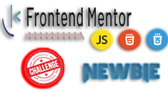
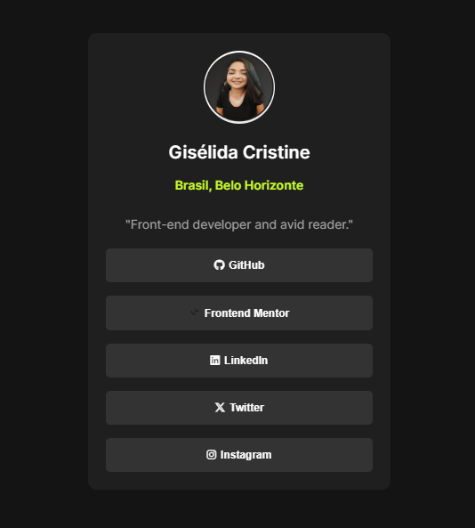

  
  

  

 
  
     
    
     
      

 <a href="#eye_speech_bubble-visualizar">Visualizar</a> •
 <a href="#information_source-sobre">Sobre</a> •
 <a href="#hammer_and_wrench-tecnologias">Tecnologias</a> • 
 <a href="#brain-conceitos-aplicados">Conceitos</a> •
 <a href="#girl-autor">Autor</a> •
 <a href="#balance_scale-licença">Licença</a>

---

## :eye_speech_bubble: **Visualizar**

Deploy do front-end efetuado no [Netlify](https://www.netlify.com/) para visualizar: [Clique Aqui](https://links-of-giselida-melo.netlify.app/)

|                            :computer:Desktop                             |                              :iphone: Mobile                               |
| :----------------------------------------------------------------------: | :------------------------------------------------------------------------: |
| <kbd></kbd> | <kbd></kbd> |

  
---

## :information_source: _Sobre_

Minha versão da aplicação proposta pelo [Frontend Mentor](https://www.frontendmentor.io/solutions/social-links-profile-FrlikQYNkK) 

---

## :hammer_and_wrench: _Tecnologias_

|            :globe_with_meridians: FrontEnd             |
| :----------------------------------------------------: |
|       [HTML 5](https://www.w3schools.com/html/)        |
|           [CSS](https://www.w3schools.com/css/)            |

---

## :brain: _Conceitos Aplicados_

|   :page_facing_up:   |
| :------------------: |
|     Mobile First     |
|      HTML Class      |
|      CSS Class       |
|       Position       |
|   Background Image   |
|   Pseudo Selectors   |
|    CSS Box Model     |
|   Size Properties    |
|       Flex-box       |

---

## :girl: _Autor_

<a href="https://github.com/giselida">
 
  
 <b>Gisélida Cristine de Melo</b>
</a>

Desenvolvido com ❤️ por Gisélida Cristine de Melo 👋🏽 Meus Contatos!

---

## :balance_scale: _Licença_

Copyright ©️ 2024 [Gisélida Cristine de Melo ](https://github.com/giselida). 
This project is licensed by [MIT](./LICENSE).

